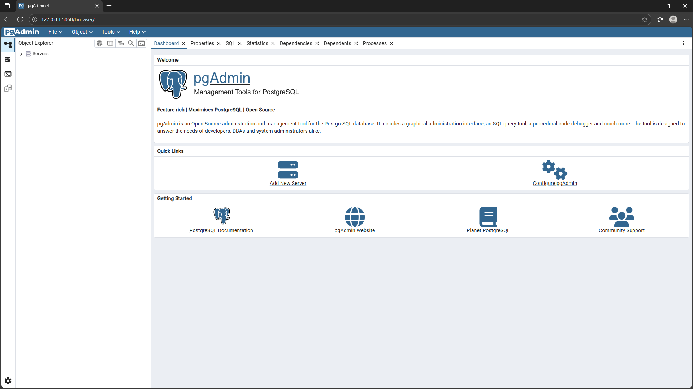
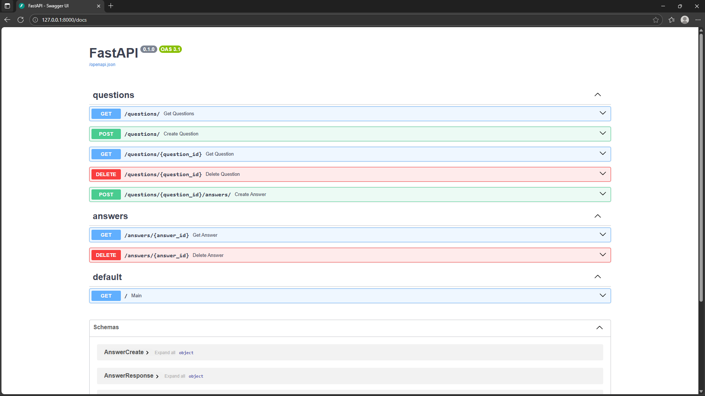

## API-сервис для вопросов и ответов
Решение тестового задания для компании Хайталент.
REST API сервис для взаимодействия с вопросами и ответами на FastAPI.
### Стек
FastAPI 0.121.2
PostgreSQL 18.1
pgAdmin 9.5
Alembic 1.17.2
Uvicorn 0.38.0
Pydantic 2.12.4
SQLAlchemy 2.0.44
PyTest 9.0.1
Poetry 2.1.3
Docker
### Методы
##### 1.  Вопросы (Questions):
   - GET /questions/ — список всех вопросов
   - POST /questions/ — создать новый вопрос
   - GET /questions/{id} — получить вопрос и все ответы на него
   - DELETE /questions/{id} — удалить вопрос (вместе с ответами)  
   - POST /questions/{id}/answers/ — добавить ответ к вопросу

##### 1. Ответы (Answers):
   - GET /answers/{id} — получить конкретный ответ
   - DELETE /answers/{id} — удалить ответ

##### GET /
Перенаправляет на /docs

### Структура
#### app
Содержит основной исходный код проекта.
	**backend**
		*Base.py* — содержит описание базового класса для моделей БД.
		*async_database.py* — содержит объяление сессии для подключения к БД.
	**models**
		*Answer.py* — содержит описание класса модели ответа.
		*Question.py* — содержит описание класса модели ответа.
	**routers**
		*answers.py* — содержит методы взаимодействия с ответами.
		*questions.py* — содержит методы взаимодействия с вопросами.
		*dependencies.py* — содержит вынесенные отдельно методы, не взаимодействующие с клиентом напрямую.
	**schemas**
		*answer.py* — содержит Pydantic формы для обработки ответов.
		*question.py* — содержит Pydantic формы для обработки вопросов.
	*config.py*  — содержит настройки для подключения к БД.
	*main.py*  — содержит основные методы сервиса и запускает проект.
	*prestart.sh*  — применяет миграции при запуске через Docker.
#### migrations 
Содержит миграции.
#### tests
Содержит тесты.
### Установка
- ####  Docker
1. Клонируйте репозиторий.
   Если запускаете на Windows и клонируете напрямую с помощью git, не забудьте использовать в терминале
   `git config --global core.autocrlf false`
2. В терминале
   `docker compose up --build`
   Приложение соберётся и запустится.
   Или 
   `docker compose build`
   для простой сборки.
- ####  Локально
Оно вам не надо.
1. Установите PostgreSQL и pgAdmin
2. В pgAdmin создайте БД с данными, описанными в config.py (db_user, db_pass etc.).
3. В папке проекта 
   `pip install poetry`
   `poetry install`
### Запуск
Сервис доступен на localhost:8000 (http://127.0.0.1:8000). При переходе на главную страницу вас автоматически перенаправит в документацию (http://127.0.0.1:8000/docs), где можно изучить проект и использовать методы.

На localhost:5050 (http://127.0.0.1:5050/browser/) доступен pgAdmin, через который можно управлять БД.

Для остановки проекта из Docker
`docker compose down`

#ENGLISH
## API Service for Questions and Answers
A solution for a test assignment for the company Hightalent.  
A REST API service for working with questions and answers, built using FastAPI.

### Tech Stack
- FastAPI 0.121.2  
- PostgreSQL 18.1  
- pgAdmin 9.5  
- Alembic 1.17.2  
- Uvicorn 0.38.0  
- Pydantic 2.12.4  
- SQLAlchemy 2.0.44  
- PyTest 9.0.1  
- Poetry 2.1.3  
- Docker  

### Endpoints

#### 1. Questions:
- **GET /questions/** — get a list of all questions  
- **POST /questions/** — create a new question  
- **GET /questions/{id}** — get a question and all its answers  
- **DELETE /questions/{id}** — delete a question (along with its answers)  
- **POST /questions/{id}/answers/** — add an answer to a question  

#### 2. Answers:
- **GET /answers/{id}** — get a specific answer  
- **DELETE /answers/{id}** — delete an answer  

#### GET /
Redirects to **/docs**

---

### Project Structure

#### app  
Contains the main source code of the project.

**backend**  
- *Base.py* — base class for database models  
- *async_database.py* — database session declaration  

**models**  
- *Answer.py* — Answer model  
- *Question.py* — Question model  

**routers**  
- *answers.py* — endpoints for working with answers  
- *questions.py* — endpoints for working with questions  
- *dependencies.py* — helper functions not directly interacting with the client  

**schemas**  
- *answer.py* — Pydantic schemas for answers  
- *question.py* — Pydantic schemas for questions  

Other files:  
- *config.py* — database configuration settings  
- *main.py* — application entry point  
- *prestart.sh* — applies migrations when running via Docker  

#### migrations  
Contains database migrations.

#### tests  
Contains tests.

---

### Installation

#### Docker
1. Clone the repository.  
   If you’re on Windows and cloning via Git, make sure to run:  
   `git config --global core.autocrlf false`

2. In the terminal:  
`docker compose up --build`
The application will be built and started.
Or:  
`docker compose build`
to build without starting the application.

#### Local installation  
(Not recommended.)  
1. Install PostgreSQL and pgAdmin  
2. In pgAdmin, create a database using the credentials specified in `config.py`  
3. Inside the project folder:  
`pip install poetry`
`poetry install`

---

### Running the Application

The service is available at:  
**http://127.0.0.1:8000**

Opening the root page will automatically redirect you to the documentation:  
**http://127.0.0.1:8000/docs**

pgAdmin is available at:  
**http://127.0.0.1:5050/browser/**

To stop the Docker services:
`docker compose down`